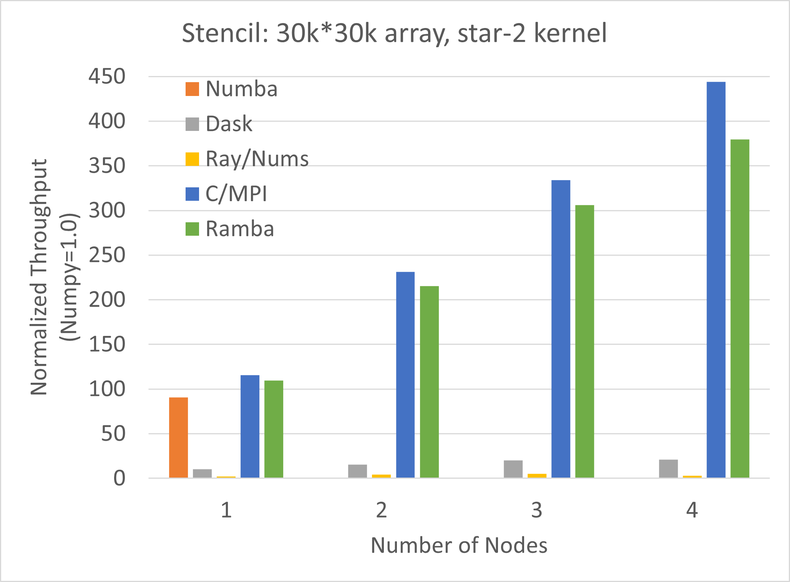

# Ramba
Ramba is a Python project that provides a fast, distributed, NumPy-like array API using compiled Numba functions 
and a Ray or MPI-based distributed backend.  It also provides a way to easily integrate Numba-compiled remote
functions and remote Actor methods in Ray.  

The main use case for Ramba is as a fast, drop-in replacement for NumPy.  Although NumPy typically uses C
libraries to implement array functions, it is still largely single threaded, and typically does not make
use of multiple cores for most functions, and definitely cannot make use of multiple nodes in a cluster. 

Ramba lets NumPy programs make use of multiple cores and multiple nodes with little to no code changes.

## Example
Consider this simple example of a large computation in NumPy:
~~~python
# test-numpy.py
import numpy as np
import time

t0 = time.time()
A = np.arange(1000*1000*1000)/1000.0
B = np.sin(A)
C = np.cos(A)
D = B*B + C**2

t1 = time.time()
print (t1-t0)
~~~

Let us try running this code on a dual-socket server with 36 cores/72 threads and 128GB of DRAM:
~~~
% python test-numpy.py
47.55583119392395
~~~
This takes over 47 seconds, but if we monitor resource usage, we will see that only a single core is used.  All others remains idle.  

We can very easily modify the code to use Ramba instead of NumPy:
~~~python
# test-ramba.py
import ramba as np  # Use ramba in place of numpy
import time

t0 = time.time()
A = np.arange(1000*1000*1000)/1000.0
B = np.sin(A)
C = np.cos(A)
D = B*B + C**2

np.sync()           # Ensure any remote work is complete to get accurate times
t1 = time.time()
print (t1-t0)
~~~
Note that the only changes are the import line, and the addition of the `np.sync()`.  The latter is only needed to wait for 
all remote work to complete, so we can get an accurate measure of execution time.

Now let us try running the ramba version:
~~~
% python test-ramba.py
3.860828161239624
~~~
The Ramba version saturates all of the cores, and results in about 12x speedup over the original numpy version. (Why only 12x?  Three factors 
contribute to this: 1) this total includes some of the intiialization time; 2) Time for JIT compile (~1 second here); 3) This code is 
memory-bandwidth bound, so after a point, additional cores will just end up waiting on memory).  Importantly, this performance gain 
is achieved with no significant change to the code.


# Quick Start

Quick install with Conda / Miniconda and git:
~~~
conda create --name ramba -y
conda activate ramba
conda install "python<3.9" numba cloudpickle pyzmq -y
pip install -U ray
git clone https://github.com/Python-for-HPC/ramba
cd ramba
python setup.py install 
~~~

Now run the provided sample file:
~~~
python sample/test-ramba.py
~~~

The first time you use Ramba, it will compile some internal functions, so the first run may be slow.  Let's run it again to see typical run times:
~~~
python sample/test-ramba.py
~~~

Finally, let's compare to the numpy version:
~~~
python sampe/test-numpy.py
~~~


# Installation
We suggest using conda to setup an environment for running ramba.  
## Prerequisites
Ramba was developed and tested on Linux, usng both Ray and MPI backends.  Ramba may work on Windows using MPI, though this has not been extensively tested.  ZeroMQ is needed for the communication layer.  
Ramba uses pickle version 5 for serializtion of objects.  This should already be available if running Python 3.8 or higher.  If not, please install the pickle5 package.  In addition, cloudpickle is also needed to serialize functions (as this is not possible through the normal pickle package).  
Finally, ramba uses numba for JIT compilation.  
Note: Ray requires Python <3.9 (Update: Python 3.9 is now supported experimentally by Ray)

Thus the requirements are:
- mpi4py and/or ray
- pyzmq
- cloudpickle
- pickle5 (if using python < 3.8)
- numba

Optional packages:
- h5py
- PIL

## Installation process
- Download / clone this repository
- run: python setup.py install

# Usage
Ramba is intended to be a drop-in replacement for NumPy.  To use Ramba, simply import ramba instead of NumPy (see [Example](#example) above).  Most array construction and operations will work as is, but will be parallelized and distributed if possible.  No special restructuring of code is necessary to use Ramba.  As with NumPy, best performance usually comes from vector-style code using operations on whole arrays or slices of arrays.  Iteration through arrays using Python loops is not recommended.  As this is the case for NumPy as well, good NumPy code should work well with Ramba, with some exceptions (e.g., reshape is not efficient in a distributed context;  see also [NumPy Compatibility](#numpy-compatibility)).

Ramba arrays are partitioned across all available workers.  Whole array operations are run concurrently on all workers, typically on local data.  If remote data is needed, this is detected and the necessary communications performed automatically.  Operations are not typically exectured imediately.  Rather, they are deferred, and multiple operations collected together, optimized and JIT-compiled into a single larger function, which is then executed on the workers.  This serves 4 main purposes: 
1) allows fusion of operations so the array may be iterated fewer times, 
2) allows parallel, multithreaded execution on each worker, 
3) can avoid the need to materialize temporary arrays to stroe intermeidate results, and 
4) executes a native binary rather than slower Python code.  

## Usage on Ray clusters
By default, when Ramba starts, it tries to connect to a Ray cluster associsted with the local machine.  If such a Ray cluseter does not exist, or it cannot connect, then a local cluster is started on the local machine.  The local cluser will use all of the available cores on the local machine, assigning one worker per core.  Note that Ray treats each virtual CPU / hyperthraed as a core, so this may not be optimal for a compute-bound task.  

To use multiple nodes, simply start a Ray cluster on the set of nodes first.  Pick one node as the "head", and run:
```
ray start --head --redis-password="<SECRET>"
```
Then, on each of the other nodes, add it to the cluster by running:
```
ray start --address="<HEAD IP>:<HEAD PORT>" --redis-password="<SECRET>"
```
Here, HEAD IP is the IP address of the head node, and HEAD PORT indicates the port it uses (printed out when the head node starts).  Typically this is 6379.  See the [Ray documentation](https://docs.ray.io/en/latest/cluster/cloud.html#manual-cluster) for more information and options for starting a Ray cluster.  

To use the cluster, run the Ramba program with environment variable ray_redis_password set to SECRET on any of the cluster nodes, e.g.:
```
ray_redis_password="<SECRET>" python my_ramba_program.py
```
If this has trouble finding the cluster (e.g., a non-default IP address or port is used), then also set the environment variable ray_address to "HEAD IP:HEAD PORT".

By default, Ramba cretes one single-threaded worker process per "cpu" resource in the Ray cluster.  Environment variabes "RAMBA_WORKERS" and "RAMBA_NUM_THREADS" can be used to override the default settings.  

## MPI Usage
Ramba can also use MPI as the backend for distribution instead of Ray.  To use MPI, simply run the ramba program using mpirun/mpiexec, with number of processes set to 2 or more:
```
mpirun -n <NUM PROCS> python my_ramba_program.py
```
Here, NUM PROCS indicates the total number of processes to use, and must be greater than 1.  One process is for the driver/controller that steps through the Ramba program.  The remaining processes are used for remote workers.  Thus, the number of processes is the desired number of workers plus one.  Other MPI options to specify hosts, indicate how to allocate processes to hosts, etc. are available as well.  

When running with MPI, the RAMBA_WORKERS environment variable is ignored.  RAMBA_NUM_THREADS can be used to indicate the number of threads to use per worker (defaults to 1).  

## Environment Variables Summary
Coming Soon!

# NumPy Compatibility
Current status of Ramba compatibility with NumPy APIs.  Key:  &#x1f7e2; works   &#x1f7e1; partial    &#x1f534; not implemented

|Feature/API | Function/type |Status&nbsp;&nbsp;&nbsp;&nbsp;&nbsp;&nbsp;&nbsp;&nbsp;&nbsp;&nbsp;&nbsp;&nbsp;&nbsp;&nbsp;&nbsp;&nbsp;&nbsp;&nbsp;&nbsp;&nbsp;&nbsp;&nbsp;&nbsp;&nbsp;&nbsp;&nbsp;| Notes
|:-----------|:--------------  |:--------------------------|:-----
|Array Types | Numerical       | &#x1f7e2; works           | complex not tested
|            | Boolean         | &#x1f7e2; works           |
|            | String          | &#x1f534; not implemented |
|            | Objects         | &#x1f7e1; partial         |
|Creation    | from size/value | &#x1f7e1; partial         | empty, ones_like, etc.;  missing: full, identity
|            | from data       | &#x1f7e1; partial         | fromfunction, fromarray
|            | ranges          | &#x1f7e1; partial         | arange, linspace, mgrid
|Array Manipulation| reshape   | &#x1f7e1; partial         | reshape is very expensive in distributed context, so only very limited support;  use reshape_copy
|            | axis manipulation | &#x1f7e1; partial       | T, transpose; missing: swapaxes, rollaxis, moveaxis 
|            | dimensionality  | &#x1f7e1; partial         | only broadcast_to
|            | joining arrays  | &#x1f7e1; partial         | only concatenate
|            | splitting arrays| &#x1f534; not implemented |
|            | tiling          | &#x1f534; not implemented |
|            | insert/remove elements | &#x1f534; not implemented |
|            | rearrange elements | &#x1f534; not implemented |
|Index/slice | range slice     | &#x1f7e1; partial         | produces view like in numpy; skips not supported
|            | masked arrays   | &#x1f7e1; partial         | only in assignments / in-place operations;  see below for details
|            | fancy indexing  | &#x1f534; not implemented |
|            | index routines  | &#x1f534; not implemented | ("where" partly works)
|Math        | arithmetic operations | &#x1f7e2; works     | +, -, +=, //, etc. 
|            | comparisons     | &#x1f7e2; works           | 
|            | logical operations | &#x1f534; not implemented |
|            | trig functions  | &#x1f7e1; partial         |
|            | power           | &#x1f7e1; partial         | pow, exp, log, sqrt, square
|            | floating manip. | &#x1f534; not implemented | (isnan works, though)
|            | bit twiddling   | &#x1f534; not implemented |
|            | reductions      | &#x1f7e1; partial         | sum, prod, min, max; axis parameter works
|            | matmul          | &#x1f7e1; partial         | matmul / dot for 1D and 2D only
| ufunc      |                 | &#x1f7e2; works           |
| FFT        |                 | &#x1f534; not implemented |
| linalg     |                 | &#x1f534; not implemented |
| random     |                 | &#x1f7e1; partial         |
| matlib     |                 | &#x1f534; not implemented |
| statistics |                 | &#x1f534; not implemented | (except: bincount is implemented)

It can be assumed that NumPy features not mentioned in this table are not implemented.

## API Extensions beyond NumPy

[Click here](https://python-for-hpc.github.io/ramba/index.html)
for documentation on the portions of the Ramba API exclusive to Ramba and for
modifications to the NumPy API as supported by Ramba.

# Security Note
Please note that this work is a research prototype and that it internally uses Ray and/or ZeroMQ for
communication.  These communication channels are generally not secured or authenticated.  This means
that data sent across those communication channels may be visible to eavesdroppers.  Also, it is means
that malicious users may be able to send messages to this system that are interpreted as legitimate.
This may result in corrupted data and since pickled functions are also sent over the communication
channel, malicious attackers may be able to run arbitrary code.

Since this prototype uses Ray, occasionally orphaned Ray processes may be left around.  These can
be stopped with the command "ray stop".

# Performance Comparisons
We use the Parallel Research Kernels (https://github.com/ParRes/Kernels) to compare Ramba performance.  
Specifically, our benchmark code is available from the RayPython branch of the mirror at (https://github.com/IntelLabs/Kernels/tree/RayPython).

We run our experiments on a cluster consisting of 4 nodes. Each node has 2x Intel(R) Xeon(R) E5-2699 v3 processors 
(total of 36 cores/72 threads, 2.3GHz nominal), 128GB RAM, and 10 Gig Ethernet.  

We run a "star" stencil operator of radius 2 on a 30000x30000 array of float32 values, and plot normalized throughput (higher is better, NumPy results=1.0). 
We compare NumPy, Numba, Dask, Nums, and Ramba.  In addition, we also compare to a C/MPI version. In the plot below, each bar is the average of 5 runs.

We see that Numba does well on a single node, achieveing 90x NumPy throughput.  
Ramba does slightly better, close to the performance of C code. Numba is of course limited to a single node.  On the other hand, Ramba performance scales 
quite well with additional nodes, just slightly behind C/MPI in absolute performance and scaling.  
Other distributed array solution in Python (Dask Arrays, Nums on Ray) are much slower.  To be fair, these are still several times (up to 20x in our tests)
faster than the baseline NumPy version, but are not even close to the performance achieved by Ramba or C/MPI.  Ramba achieves 380x
NumPy throughput on 4 nodes, and achieves 85% of C/MPI performance, with largely unmodified NumPy code.  



The plot is based on the average and standard deviations of throughput numbers reported by multiple runs of PRK stencil benchmark, summarized below (std. dev in parentheses):

|       | 1 Node        | 2 Nodes       | 3 Nodes           | 4 Nodes          |
|:------|:--------------|:--------------|:------------------|:-----------------|
| NumPy | 453 (0.8)     |               |                   |                  |
| Numba | 41172 (2563)  |               |                   |                  |
| Dask  | 4746 (1868)   | 6995 (707)    | 9040 (696)        | 9563 (1392)      |
| Nums  | 995 (22)      | 1843 (27)     | 2376 (50)         | 1333 (25)        |
| C/MPI | 52308 (238)   | 104695 (58)   | 151327 (943)      | 201156 (465)     |
| Ramba | 49748 (168)   | 97619 (120)   | 138725 (343)      | 172050 (6720)    |

